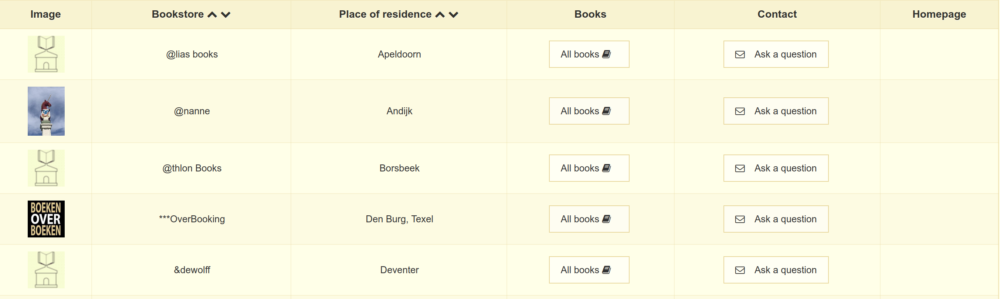
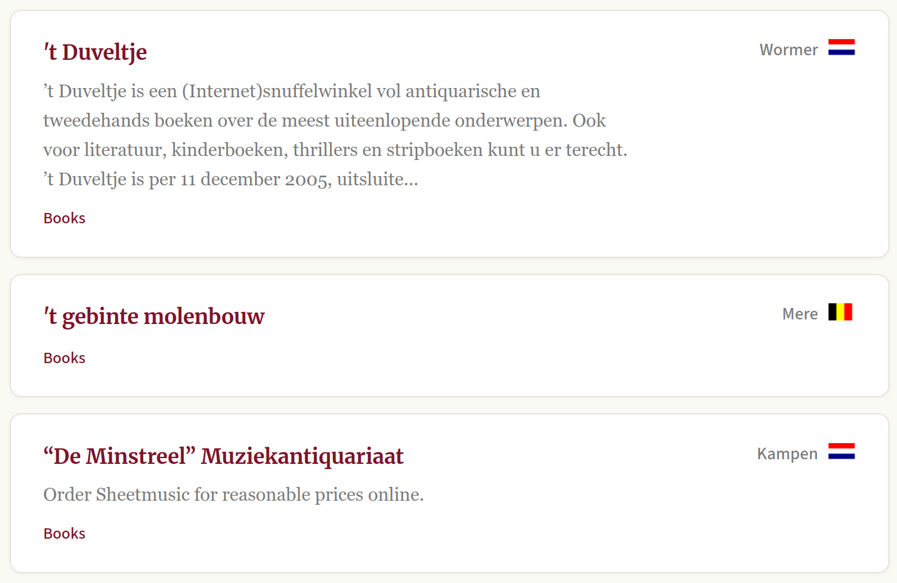
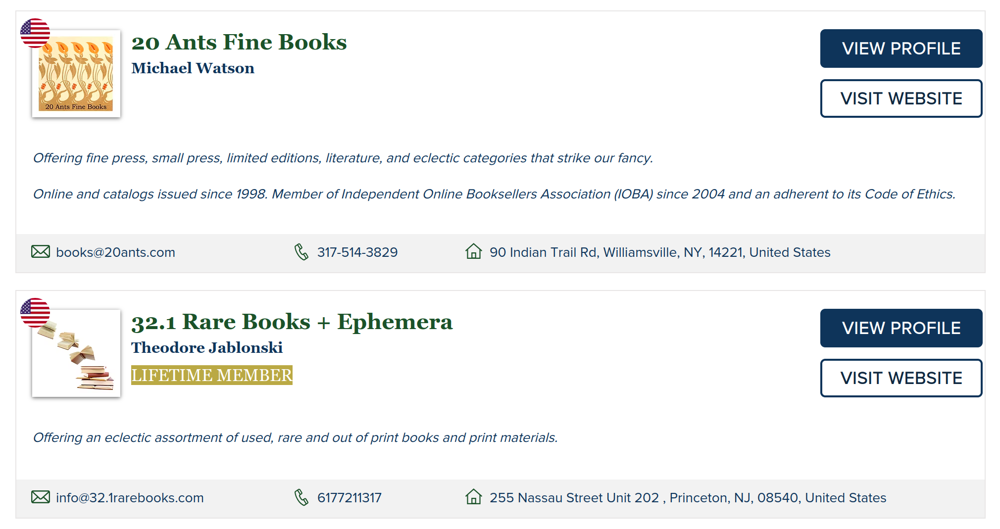
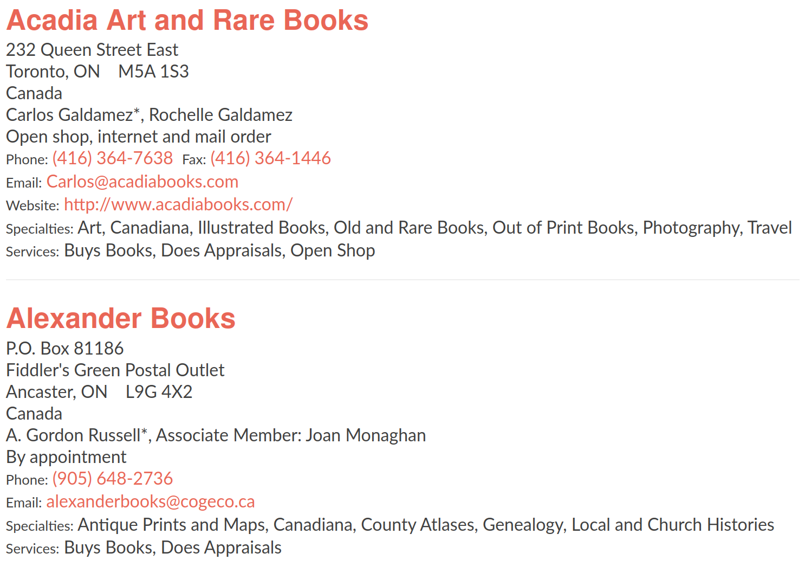

# Multi Source Project

A project which is extracting data from 5 websites on the internet and saving it into a single .csv file.

This project is running 5 extraction engines at once - by utilizing the cores of my cpu, with the help of multiprocessing.

### Target Data

The information that I am extracting from the site:

* Image Source

* Bookstore Name

* Location of bookstore

* More books by author

* Contact information

* Address

 

You can check how the data looks like on the website by clicking below:

  
<b>Click here for Target Data</b>

   
  
  
  
  
  

### Demo

https://github.com/user-attachments/assets/d3168cf3-abd6-490e-bb62-4a637218d194

You can check the sample of spreadsheet created during the full run of this project, right here:

[Preview File](https://www.dropbox.com/scl/fi/vk3jzv9bi46tr334u7fhq/bookstore_listings.csv?rlkey=e9pd1rbazsqyrbr8tl4x4i4bk&st=7085j92b&dl=0) | [Download](https://www.dropbox.com/scl/fi/vk3jzv9bi46tr334u7fhq/bookstore_listings.csv?rlkey=e9pd1rbazsqyrbr8tl4x4i4bk&st=7085j92b&dl=1) 

