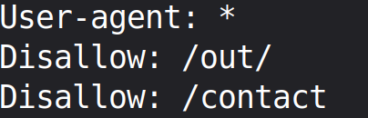
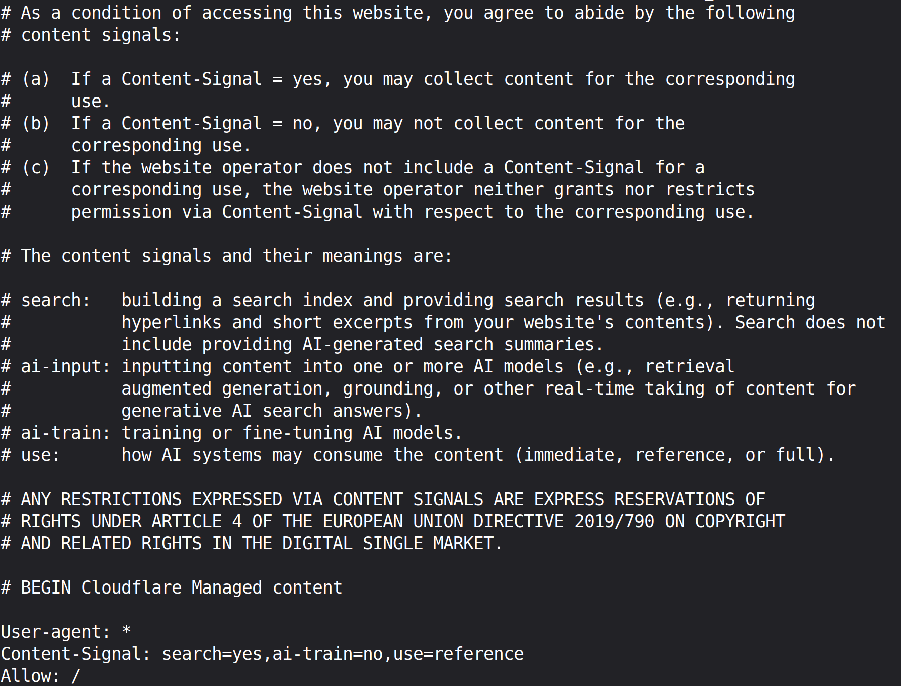
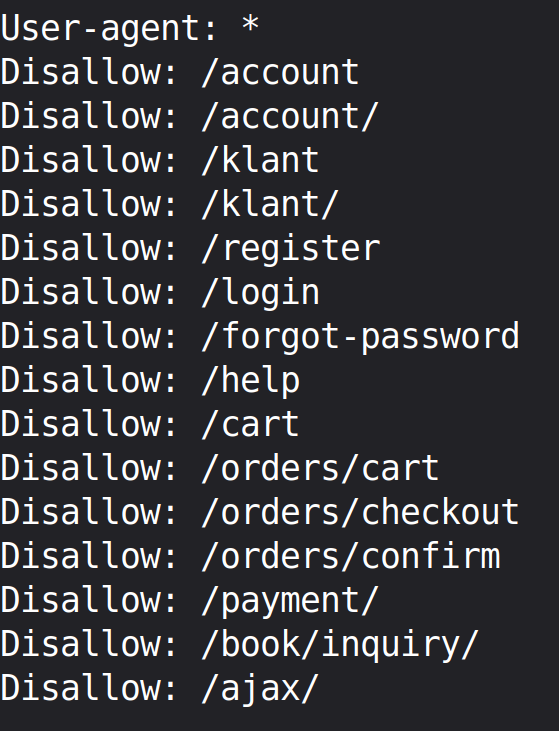
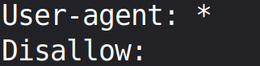
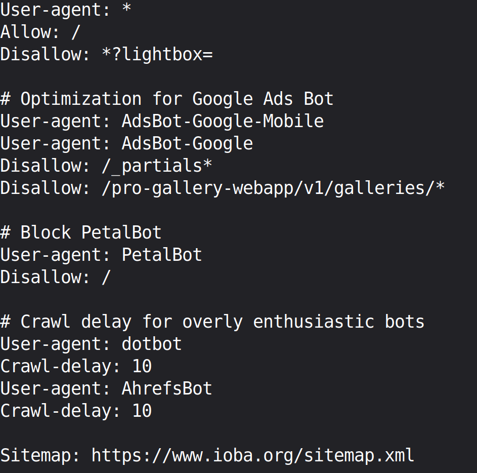
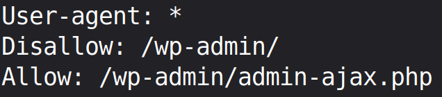

# Multi Source Project

A project which is extracting data from 5 websites on the internet and saving it into a single .csv file.

This project is running 5 extraction engines at once - by utilizing the cores of my cpu, with the help of multiprocessing.

### Target Data

The information that I am extracting from the sites:

* Outside Image of the Store

* Bookstore Name

* City of the store

* More books by author links

* Contact information

* Address

 

You can check how the data looks like on those websites by clicking below:

  
<b>Click here for Target Data</b>

   
  
  
boekwinkeltjes.nl

  
  
antiqbook.com

  
  
pbfa.org

  
  
ioba.org

  
  
abac.org

 

You can access the links to the websites down below:

[Website #1](https://www.boekwinkeltjes.nl/w/list/page/1/) | [Website #2](https://www.antiqbook.com/dealers) | [Website #3](https://www.pbfa.org/shops) | [Website #4](https://www.ioba.org/members-directory) | [Website #5](https://abac.org/en/members/)

### Demo

https://github.com/user-attachments/assets/5471449e-db0c-427c-b022-3075a2077a2c

You can check a sample of spreadsheet created during the full run of this project, right here:

[Preview File](https://www.dropbox.com/scl/fi/vk3jzv9bi46tr334u7fhq/bookstore_listings.csv?rlkey=e9pd1rbazsqyrbr8tl4x4i4bk&st=7085j92b&dl=0) | [Download](https://www.dropbox.com/scl/fi/vk3jzv9bi46tr334u7fhq/bookstore_listings.csv?rlkey=e9pd1rbazsqyrbr8tl4x4i4bk&st=7085j92b&dl=1) 

### How does it work?

This project is using 5 separate extraction engines at once, all extracting, cleaning, and loading data from 5 different websites into a .csv.

Typically, you can not run 5 extraction engines all at the same time! 

But, Python has a multiprocessing library which allows me to run all 5 different extraction engines at the same time by utilizing my laptop's cpu and running them all on different cores.

Then, I am using Python's rich library to give the extraction engines an interface so that all 5 of them can show me what they are doing during execution.

### Benefits of creating the extraction pipeline

One of the main benefits of creating this pipeline is: If you start typing every single word of data available on any of these websites, things can take an overwhelming amount of time. 

However, this project just does it all in one click! Of course, you have to wait for a few minutes to get completely cleaned extraction in a spreadsheet.

Getting data into a spreadsheet means - you can do all sorts of excel things with the data!

Just in case, you ever need the updated data, fire up the project with one click and it will update the spreadsheet!

### Safety Guidelines

This script is only taking public data and isn't breaking any rules! The creation of this script is strictly following all the rules and regulations of the websites given at robots.txt

I am interested in the art of web scraping and only doing this for learning purposes! 

> **Robots.txt were last checked on date: August 9, 2026**

> **If anyone has any problems regarding this repo, please feel free to contact me!**

Screenshots from website.com/robots.txt page are given below:

  
<b>Click Here to View robots.txt Screenshots</b>

   
  
  

  boekwinkeltjes.nl
  

  
  
  
antiqbook.com

  
  
pbfa.org

  
  
ioba.org

  
  
abac.org

### Tech Stack

* python: the language I am using

* httpx: for fetching the html page from the internet

* beautifulSoup4: for creating a Document Object Model(DOM) of the HTML tags

* lxml parser: for parsing with speed - Written in C

* json: for storing data in the extraction phase and taking load off from the RAM

* pandas: for creating the .csv file using json files

> loguru: for logging and monitoring the entire process in the backgound

> rich: for providing the terminal user interface

> multiprocessing: for using my cpu cores to fire all extraction engines - at the same time
